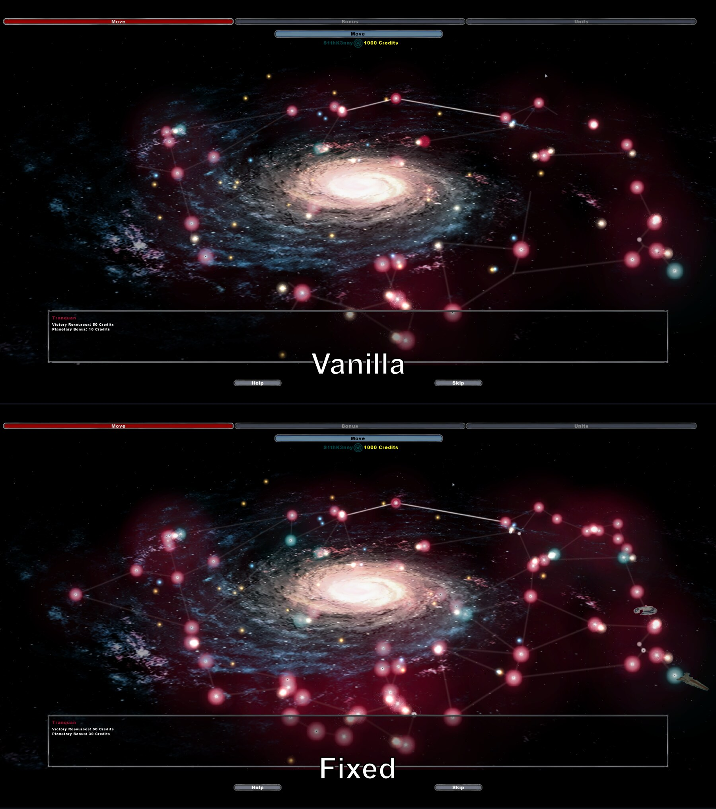
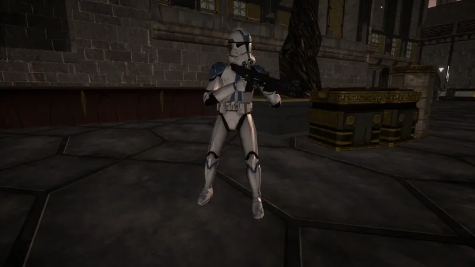
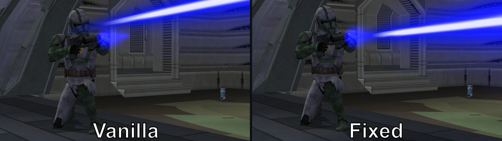
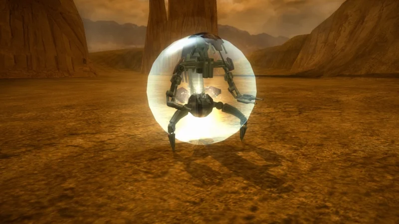

# Features

See the [compatibility table](../../README.md#compatibility) for the current state of each build.

Every ODF property added by BF2GameExt is collected in one place in the **[ODF Properties](ODF_PROPERTIES.md)** reference.

## Engine Limit Extensions

Automatic binary patches applied on load:

- **Heap Memory Extension** - Increases the game's main memory heap from 64 MB to 256 MB, drastically reducing out-of-memory crashes
- **DLC Mission Limit** - Increases from 500 to 4096, allowing more mods installed simultaneously
- **Sound Layer Limit** - Prevents crashes on maps with many flyers or entities using EngineSound
- **Sound Memory Limit** - Increases sound RAM from 32 MB to 256 MB
- **Audio Stream Limit** - Raises the number of audio streams that can be open at once from 6 to 12, removing the `Maximum number of open audio streams exceeded` failure when a mission script calls `OpenAudioStream` more than six times. Each stream carries its own ~3.4 MB of decode buffers, so the 12-slot array reserves about 40 MB of *virtual address space*. Turn this off if a heavy mod is running out of address space. INI: `[LimitIncreases] AudioStreamLimit=1`

  **Caveat:** the shared fire-and-forget request pool stays at 24 entries, so a script queueing sounds on all 12 streams at once can still hit that older limit. Exceeding it drops the queued request rather than failing the stream.
- **Particle Cache** - Increases the cached particle limit from 300 to 1200. Now part of the particle fixes below rather than its own switch. INI: `[Particles] ParticleFixes=1`
- **Concurrent Sound Limit** - Raises how many sounds can be audible at once from the stock 32 to as many as 119, so a busy firefight stops dropping shots, footsteps and voice lines. Off by default because the extra voices have to come from somewhere: under EAX (5.1/7.1, or any audio mode using hardware) they are taken from your sound device and it must have some spare, while software mixing needs nothing extra but costs more CPU. Costs 1.4 KB per voice. INI: `[LimitIncreases] VoiceLimit=0`
- **AI Reservation Pool** - Squads book vehicle seats, repair points, attack slots and formation positions out of a single 60-entry pool. On a busy map it fills, units stop being handed work, and the log fills with `List pool is full`. Raised to 127 for 1.6 KB. INI: `[LimitIncreases] ReservationPoolSize=127`
- **Soldier Height Ceiling** - Stock BF2 kills any soldier who goes higher than 1000 units, including on spawn, which caps how tall a map can be built. Flyers were never affected. Off by default, because a soldier who genuinely escapes upward is then never cleaned up. INI: `[LimitIncreases] SoldierHeightCeiling=0` *(off by default)*
- **Object Limit** - Doubles the active object table from 1024 to 2048 slots, raising how many objects a map can have alive at once
- **Combo Animation Limit** - Increases from 30 to 90 entries, with an expanded animation index range
- **High-Res Animation Limit** - Increases from 50 to 12,800 entries
- **Soldier Animation Bank Limit** - Raises the per-class loaded animation bank cap from 18 to 128, removing the `Out of space for soldier animation banks (max 18)` error. Note that a bank split into numbered sub-banks (`human_0` through `human_N`) uses one slot each, so this lets a class load far more split banks than before.

  **Caveat, a separate and deeper limit is not raised:** the number of *distinct bank names* is capped at **16** and *weapon types* at **20**. Those two cannot be raised safely. Keep modded soldier classes to 16 or fewer distinct bank names and 20 or fewer weapon types.
- **LOD Limit** - Keeps far more models at full detail before they swap to their low-detail version. Stock budgets allow only nine soldiers on screen at full detail, so troops visibly turn into their low-res models as soon as a fight gets busy; this raises that to roughly 180. Also applies to props, large models and terrain-scale models. INI: `[LimitIncreases] LODLimitExtension=1`
- **Explosion Visibility** - Explosions more than a short way off were not drawn at all, so distant fighting looked empty and silent. They are now visible across the map. Applies to every explosion that does not set its own visible radius. INI: `[LimitIncreases] ExplosionVisibleRadius=1`
- **String Pool** - Increases the string pool from 32 KB to 128 KB, preventing crashes in debug builds with heavy string usage
- **Matrix/Item Pool** - Extends the matrix pool to 256 times its original capacity
- **Renderer Cache** - Increases the particle renderer cache from 15 to 120 entries
- **Input Update Rate** - The engine runs two fixed-rate update timers. The second one gates keyboard, joystick and voice chat updates, and was fixed at 30 Hz, so input was only sampled 30 times a second no matter how high the framerate ran. This raises it to 120 Hz. The simulation timer is untouched, so nothing about game speed or netcode changes, input just stops being the slowest thing in the loop. INI: `[LimitIncreases] NetworkTimerIncrease=1`
- **Sky Object Limit** - Removes the cap on how many objects a sky dome or backdrop can contain. Port of PrismaticFlower's upstream fix. INI: `[Fixes] SkyObjectLimit=1`
- **Tentacle Limit** - Raises how many tentacles a unit can have from 4 to 9. Units asking for 4 or fewer, which is every stock unit, behave exactly as before. Bones per tentacle stays capped at 5. Off by default. INI: `[LimitIncreases] TentacleLimit=0`
- **GC Visual Limits** - Raises Galactic Conquest per-frame rendering limits: pathway beams from 64 to 256 (255 on Steam), and planet icons from 128 to 512. Also spreads beams across spare cache slots when the shared batching cache fills up. Without that, every pathway beam competes for one cache and they silently stop drawing at roughly 50 beams no matter how large the buffer is. Fixes pathways and fleet/planet icons disappearing on modded GC maps with many planets. INI: `[LimitIncreases] GCVisualLimits=1`

  

  *Taken with ['Choose Your Own' Galactic Conquest](https://www.moddb.com/mods/choose-your-own-galactic-conquest).*

## Engine & Rendering Fixes

General engine bug fixes, several of them ported from PrismaticFlower's upstream. Build restrictions and INI keys are noted per entry:

- **PropGenerator Loop Fix** - The procedural foliage system could read past the end of its object array at very high fields of view and crash. The patch restores the missing bounds check. INI: `[Fixes] PropGeneratorLoopFix=1`
- **Particle Fixes** - Effects stop dropping out when a lot of them are on screen at once, and particles stop switching off for the rest of the session after a single bad frame. INI: `[Particles] ParticleFixes=1`
- **Particle Density** - Controls how much the game thins particle effects out with distance. `1` keeps full density near and mid-range and lets an effect that asks for more than 128 particles have them; `2` removes distance thinning entirely. Higher costs frame time. INI: `[Particles] ParticleDensity=0` *(stock by default)*
- **Memory Pool Heap Fix** - A map could crash the first time one of its memory pools needed to grow, because the pool was still handing out memory that had been released at the end of the level load. A mission script can dodge this with `SetMemoryPool`, but only if you still have the script, so this covers maps whose source is lost. Always on.
- **Command Post Null Fix** - A mission script pointing command post logic at something that is not a command post crashed the game. It now logs what happened and keeps playing. Always on.
- **Attached Effects Overflow Fix** - A model carrying more than 64 attached effects built its class from whatever memory sat after the array and killed the level while spawning them. The extras are now refused cleanly, which is what the retail builds already do. Nothing changes for a model within the limit. Modtools only, always on.
- **EntityPath Branch Regions** - The `BranchRegion` property on a path node never did anything in stock BF2; no branch region was ever created, so a path could not fork. Name the region `entitypathbranch <id>` and write `BranchRegion("<id>")` in the path node. INI: `[Fixes] BranchRegionFix=1`
- **Impact Sound Fix** - On a map with no water, anything happening below world height 0 made no impact sound at all. Maps that do have water still go quiet under the surface. INI: `[Fixes] ImpactSoundWaterFix=1`
- **Chunk Push Fix** - When an explosion sweeps up a soldier, the engine rolls the class's chunk frequency to decide whether the body breaks apart into chunks. If that roll passes it flags the body and returns immediately, before the explosion's push is ever applied, so a body that gibs simply drops where it stood while a body that does not gets thrown. The fix lets the push run either way, so chunked bodies are flung by the blast like everything else. INI: `[Fixes] ChunkPushFix=1`
- **Terrain Texture Fix** - The terrain shader caches two textures that only get assigned on maps that have a terrain detail map. Going from a map with one to a map without one in the same session left the shader pointing at freed memory, producing garbage terrain or a crash. The fix re-resolves both textures before every terrain load so they are always valid. Also fixes an upstream copy-paste bug that fed the wrong texture into one of the two slots. INI: `[Fixes] TerrainTextureFix=1`
- **Game Logging Enablement** - Retail builds ship the engine's `BFront2.log` file logging compiled in but switched off. This turns it back on without needing the `/log` command line flag, which is useful for diagnosing crashes and mod issues. No effect on Modtools, which always logs. INI: `[Features] GameLogging=0` *(off by default)*
- **Enable Sound Warnings** - When an ODF references a sound that is not loaded, the engine can warn about it, but the warning is switched off by default and cannot normally be enabled. This turns it on so missing sound names show up in the log. Modtools only: the retail builds compiled the warning code out entirely, so there is nothing to enable there. INI: `[Features] EnableSoundWarnings=0` *(off by default)*
- **Blur Downsize Clamp** - The blur effect renders into a buffer sized by a factor tuned for 2005 era resolutions. At modern resolutions that buffer ends up far larger than intended, which makes the blur both weaker looking and more expensive. This clamps it to 512 pixels on its long edge. INI: `[Fixes] BlurDownsizeClamp=1`
- **Screenshot Fix** - Print Screen crashes the retail builds. Replaces the broken screenshot routine with a clean capture written to `ScreenShots\screenshot_NNNN.tga`. No effect on Modtools. INI: `[Fixes] ScreenshotFix=1`
- **Error Dialog Fix** - The retail builds are missing the dialog resource the engine uses for fatal error messages, so those dialogs silently fail and the game just exits with no explanation. This supplies a replacement dialog from BF2GameExt so the error is actually shown. No effect on Modtools. INI: `[Fixes] ErrorDialogFix=1`
- **DLC Mission List Initialization Fix** *(experimental, off by default)* - Launching straight into a mod map from the command line fails, because the addon mission list is only built when the shell menu runs. This enters and immediately exits the shell first, giving addon scripts their normal context. Ported from upstream but not yet confirmed working on retail builds, where command line addon launches still fail. INI: `[Fixes] DLCMissionInitFix=0`
- **HUD Widescreen Reticle Correction** - On widescreen displays the game scales and offsets every HUD element, which pushes the aim reticle off the true aim point, with the error growing toward the screen edges. This pre-corrects the reticle so it lands in the right place, leaving all other HUD elements untouched. INI: `[Fixes] ReticleCorrection=-1` (auto; `0` disables, or set `0..1` manually)
- **Custom Weapon Icon Fix** - Mods that add weapons ship a small HUD file so their weapons get an icon, and each one works on its own. Load two of them in the same session, such as a map mod together with a side mod, and you would get two icons for the same weapon: the correct one plus a stray one showing the weapon's world model in the wrong place. Which weapons broke depended on load order, so it looked random. Each mod's icons now work with the others loaded, and stock icons that some mods were also displacing come back. INI: `[Fixes] WeaponIconFix=1`
- **HUD Editor Removal** - Steam and GOG still respond to a leftover development key combination that pauses the game and puts an unusable layout editor on screen. The key does nothing now. No effect on Modtools, where the HUD editor is a working tool and is left alone.
- **Map Queue Next Mission Fix** - Finishing a match on Modtools always dropped you back to the main menu, even when the mission playlist still had maps queued. This was due to the branch simply not being present due to the modtools simply being older than the retail builds. The branch is restored and the queue now rolls straight into the next map the way it does on retail.
- **Jetpack First Person Sound Fix** - Switching to first person while the jetpack was running played the jetpack's shutdown sound and left the rest of the flight silent. The jetpack now keeps its sound when you change view, and still shuts down normally when you stop flying.
- **Hero Team Switch Fix** - Dying as a hero left you unable to change teams. The team switch would silently do nothing, and stayed that way until you respawned as a regular unit. Team switching now works normally after a hero dies. Playing as a hero still blocks it, the same as it always has.
- **Water Texture Settings Fix** - A world whose `.fx` water settings were written without their frame count, as in `NormalMapTextures("water_normalmap_")`, crashed the retail game while the map was loading, even though the same map loaded normally under Modtools. Some `.fx` export tools drop those numbers. Listing more frames than the game supports crashed it the same way. Both are now handled so the map loads, and the log names the water setting and what was wrong with it so it can be corrected in the world's `.fx` file.
- **Reverb Restore On Map Exit** - Environmental audio effects (EAX, as provided by wrappers such as DSOAL) stopped working for the rest of the session once you left a map through the pause menu. Restarting a mission kept them, quitting to the main menu and loading anything else killed them until the game was closed and reopened. Reverb now comes back on every map you load. Always on.
- **Multiplayer Spawn Delay** - Multiplayer always makes you wait 15 seconds to respawn. The number is hardcoded, and the game reads the mission script's `SetSpawnDelay` and then throws it away online, so no map could change it and neither could a host. Set this to the wait you want, in seconds; anything from 0.1 to 300, decimals allowed. Only the host sets it; everyone else follows with nothing installed. INI: `[Features] MPSpawnDelay=15`
- **Custom In-Game Movies** - `ScriptCB_PlayInGameMovie("ingame.mvs", "segment")` looks like it takes a movie file, but every shipping build throws that first argument away and hardcodes the file, picking `ingame.mvs` (or `ingamefr.mvs` / `ingamegr.mvs` on French and German) from a language table. A custom in-game movie could therefore only ever be played by overwriting the stock `ingame.mvs` in the base game folder. The argument now works, and understands the `dc:` addon prefix, so a mod can ship its movie in its own addon folder. The three stock names still take the old path, so the localised campaign movies are unchanged. See **[Lua API](LUA_API.md)** for the usage.

## Loading Screen System

Adds new loading screen parameters that **allow modders to fully restore bf1 style loading screens.** 
These work alongside the vanilla ones by redirect the whole loading screen configuration to a custom `load.cfg` from Lua.

See **[Loading Screen](LOADING_SCREEN.md)** for the full parameter reference.

## Soldier Systems

- **Prone Stance** - Re-enables, fixes, and adapts the cut prone posture. Double-tap crouch to go prone, any crouch press to stand back up. Includes a terrain fix that stopped prone working on slopes. The prone animations live in their own `prone.lvl`, which is read automatically after every `ingame.lvl`. Drop `prone.lvl` into `data\_lvl_pc\`; if it is not there, prone stays off for that mission. INI: `[Features] Prone=1`

  

  *Taken with [Star Wars Battlefront 3 Legacy](https://www.moddb.com/mods/star-wars-battlefront-iii-legacy). Prone applies to vanilla and any mod*

- **First-Person Fire Animation Fix** - Fixes the first shot after switching into first person playing no weapon animation. The dead spell lasted about a second after entering, and longer the first time a unit's first person model was used, so shots fired in that window looked like nothing happened. Soldiers only; vehicle cockpits were never affected.
- **Multiple First-Person Animation Banks** - Lets each soldier class use its own first person animation bank instead of sharing one global set. Partial banks work too, with missing animations falling back to the defaults. ODF: `FirstPersonAnimationBank = bankname`
- **First-Person Sprint Animation** - The engine has no first person sprint state and just plays the run animation faster. This adds the possibility for modders to add a real sprint animation per weapon class. If `<bank>_rifle_sprint` (or `_bazooka_sprint`, `_tool_sprint`) exists in the bank it is used while sprinting. Works with custom banks, and is entirely optional: if the animation is absent, nothing changes.
- **Animation Bank Appending** - Lets an animation bank be extended with extra numbered sub-banks spread across multiple .lvl files. The engine only scans for sub-banks once, during the first .lvl load, so a sub-bank that arrives later (for example `human_5` from a modified `ingame.lvl` after a mod's own `ingame.lvl` already registered `human_0`) was silently ignored. This picks up the late arrivals. Works for any bank, not just `human`. *The animation bank needs to be split into sub-banks for this to work.*
- **Extra Override Textures** - The stock engine gives soldier classes two runtime texture override slots. This adds three more: `OverrideTexture3`, `OverrideTexture4` and `OverrideTexture5`. The extra slots ride on the stock render path, so `OverrideTexture` must also be set for them to apply. Set them on the concrete soldier class; they are not inherited through `ClassParent`. The underlying system is fully dynamic, so the count could be raised further, though more than five is untested.
- **Unit Class Removal** - Remove classes from a team's spawn menu at runtime. See [Lua API](LUA_API.md).
- **Award Removal** - ...Can I even call this a feature? The awards are enabled permanently, even if you turn off the visual effects via the 1.3 or 1.5 patch. Four of the nine grant a passive that never wears off, the other five grant an upgraded weapon. Two INI toggles remove either group without touching the buff system itself, so buff pickups and the officer class buff weapons keep working as before. Both are off by default. `[Features] DisableAwardBuffs=1` drops the permanent buffs; technician's award weapon shares the same unlock flag as its passive, with nothing in the engine separating the two, so that one weapon stays locked as well. `[Features] DisableAwardWeapons=1` drops the award weapons. Set both to disable all nine awards.

## Weapon Systems

- **Command Post Overflow Fix** - The game keeps room for exactly sixteen command posts and never checks before adding the seventeenth, so it writes one slot past the end and hands whatever engine value happens to live there to a command post as its own address. That is an instant crash, and it is reachable in stock play because destroying a post empties its slot without giving the count back - so a long session that cycles posts creeps up to the limit even on a map with far fewer than sixteen. This reuses an abandoned slot where one exists, and otherwise binds to an existing post rather than crashing. INI: `[Fixes] CommandPostOverflowFix=1`
- **Barrel Fire Origin Fix** - Fixes projectiles spawning from `bone_head` instead of `hp_fire` on `cannon` and `launcher` weapons, so shots come out of the actual barrel hardpoint, and re-aims them so moving the muzzle costs no accuracy. **This changes aim behaviour, not just where the bolt appears.** Stock BF2 converges a third-person shot onto the camera line at only about 65 units, so past that its own shots drift off the crosshair - wider the further you shoot. This resolves what you are actually pointing at and aims there, so shots land on the crosshair at every range. It also removes the small hipfire offset first person has in stock, where the shot leaves parallel to your view rather than along it. Shots into open sky or across water converge far down the line you are pointing at, so the bolt still leaves the barrel. AI shots needing more correction than the AI aim system can hold are left stock rather than forced. INI: `[Fixes] BarrelFireOriginFix=1`

  

  *Taken with [The Clone Wars Revised](https://www.moddb.com/mods/the-clone-wars-revised). Issue + fix apply to vanilla and any mod*

- **Combo Animation Fix** - Melee heroes could crash the game the instant they spawned or swung, and a character carrying more combo animations than the game has room for would play another character's animations instead of its own. Both are handled now: the unusable animation is skipped, and the log names the animation map and index so the combo can be corrected. Always on.
- **Lightsaber Block Fix** - Fixes lightsabers almost never blocking other lightsabers. In stock BF2 a saber block only registers while you happen to be aiming at the centre of the map, so duels come down to whoever swings first. Blocks now resolve against your attacker from anywhere, and the deflect animation matches the side the swing came from. Blaster deflection is unaffected. INI: `[Fixes] SaberBlockFix=1`
- **Shield Channel Fix** - Fixes shield weapons activating regardless of which secondary weapon is selected, so firing a grenade or a detonator would raise the shield instead. The shield now only responds when it is the secondary weapon you actually have out. A shield you raised and then switched away from keeps ticking down and disappears properly when it runs out, instead of leaving the bubble stuck on screen after the protection is already gone. Getting into a vehicle or turret with the shield up drops it the moment you board, instead of parking the bubble at the centre of whatever you climbed into.
- **Disguise Model Override** - Lets WeaponDisguise swap the soldier's model to a specific model instead of cloning the first enemy soldier. ODF: `DisguiseModel = modelname`
- **Animated Lightsaber Textures** - Ports the Xbox version's animated blade textures, giving a lightsaber a four frame texture cycle where PC blades use a single static texture. ODF, under the blade's WeaponMelee section: `AnimTexture1 = tex_frame2`, `AnimTexture2 = tex_frame3`, `AnimTexture3 = tex_frame4`
- **Grappling Hook** *(experimental)* - Re-enables the cut grappling hook weapon. Fire it at solid geometry and it pulls you to where it stuck, cable and all. Press fire again to change your mind: while the hook is flying or stuck somewhere useless it cuts loose and reels back in, and part way up a pull it flings you off along the rope with the speed you had built up. You keep falling normally until the hook actually catches something. It catches on terrain, buildings, props and vehicles, but not on soldiers or pickups, and it lets go if you climb into anything. Give the ordnance a `SoldierAnimation` and the soldier plays that clip for the whole ride, otherwise they keep their normal pose. Pull speed is the ordnance's own velocity, halved on impact, so tune it there. The cable can be re-skinned, though the texture is shared by every grapple in a mod rather than set per weapon. Modtools only. ODF, on the ordnance: `SoldierAnimation = animname`, `CableTexture = texturename`
- **Lightsaber Illumination** - Stock lightsabers give off no light: the blade is only a glowing sprite, so a duel in a dark room leaves everyone unlit. Each ignited blade now casts a real light in its own blade colour, growing as the blade ignites, on stock and modded sabers alike with no ODF changes. On by default; a nearby saber can replace one of a room's own lights, so set `LightsaberIllumination=0` for stock lighting. INI: `[Lightsaber] LightsaberIllumination`, plus `LightsaberLightRadius` (reach, default 4.0) and `LightsaberLightIntensity` (brightness, default 1.0)

## Vehicle Additions and Fixes

- **Command Post Vehicle List** - On the spawn screen, highlighting a command post now lists the vehicles that spawn there, the way SWBF1 did. Stock BF2 leaves that line of the spawn screen blank on every map. The list follows whoever owns the post and updates as you move between posts. Works in vanilla and any mod. For modders wanting to change it up: The HUD item for it is `player1spawnvehicle` INI: `[Features] SpawnVehicleList=1`
- **Carrier Class** - EntityCarrier was an unused class. Now, it's a completely usable class with proper landing oscillation, cargo attachment, level of detail rendering, turret activation and animation, making it usable as a VehiclePad.
- **Droideka Death Animation Fix** - Droidekas never played their death animation even though every stock droideka bank defines one. A bug cut the animation off after a single frame, so the droideka just exploded instantly, while walkers like the ATST, ATTE and ATAT played theirs correctly. The fix lets the death animation run to completion, and drops the personal shield as soon as the droideka starts dying instead of leaving it up through the collapse. Rolling droidekas still explode instantly by design, and banks with no death animation are unaffected. INI: `[Fixes] DroidekaDeathAnimation=1`

  

- **Flyer Boost Animation** - If a flyer's animation bank contains an animation named `boost`, it plays automatically when boosting, with a smooth blend in and out. Frame 0 should be the normal flying pose and the last frame the full boost pose. How long the animation is sets how long the blend takes, so add frames to slow it down and remove frames to speed it up.
- **Vehicle First/Third Person Toggle** - Fixes the change view button being silently ignored on hovers and walkers. Both classes shipped with the view change permanently reported as suppressed, so ground vehicles were stuck in third person unless `ForceMode` was set in the ODF. Also applies to their AI controlled variants.
- **CreateEntity Vehicle Weapons Fix** - Vehicles spawned from Lua with `CreateEntity` worked fine except that their weapons silently did nothing. Stock `CreateEntity` skips the team assignment and activation steps the normal vehicle spawner performs, and without a team the game refuses to spawn projectiles. This runs the missing steps automatically. Adds an optional fourth argument, `CreateEntity(class, matrix, name [, team])`, defaulting to 0 if omitted. Existing call sites keep working unchanged.
- **LandOnArrival Fix** - The path node property `LandOnArrival` is read for every node but never worked as authored, because of two engine bugs. Only the first node in a path was ever checked, and once a flyer landed the flag was never cleared, so it re-triggered the landing every frame and could never take off or be used again. The fix makes arrival at any flagged node land the flyer, and clears the flag afterwards so the vehicle can be entered by AI and players.
- **Flyer Engine Sound Fix** - AI flyers following waypoint paths had stuttering, warbling engine audio. The path follower's speed varies very slightly every frame, and the engine sound amplified that jitter into large pitch and volume swings. This smooths the speed inputs so the jitter is damped out, while player controlled flight is effectively unaffected.
- **Self-Piloted Hover Crash Fix** - A hover vehicle with `PilotType = "self"` crashed the game outright. The hover's obstacle avoidance fetches the vehicle's pilot without checking whether there is one, and a self piloted hover has no separate pilot. Every stock hover is soldier entered, so the case was never guarded. This handles the missing pilot safely, along with a second crash of the same kind when the vehicle acknowledged a unit order.
- **Droideka Ball Mode Toggle** - The droideka is the only playable walker and vehicle hybrid, so its roll is welded to the chassis. A mod that wants it as a plain walking unit can ask the player not to press the button, but the AI still rolls. `DisableBallMode = 1` on a walkerdroid class removes the roll outright, for the AI as much as the player. It is per class, so a rolling and a non-rolling droideka can coexist, and it inherits through `ClassParent` like a stock property. The spawn screen follows suit: a droideka that cannot roll is previewed standing and idling instead of curled into a ball. Off by default. ODF: `DisableBallMode = 1`

## AI Systems

- **AI Decision Rate** - Distant AI look like they are standing around, because stock BF2 only lets a unit away from a player pick a new goal every two to four seconds. This is a multiple of that rate: `2.0` makes them think twice as often, below `1.0` slows them down to buy frame time back. AI next to you are unaffected. Range 0.25 to 4.0. INI: `[AI] AIDecisionRate=1.0`
- **AI Update Budget** - Only ten AI may pick a new goal per turn in stock BF2. A unit that misses its turn keeps walking and shooting but never re-decides, which is the other half of what standing around looks like. Raising this costs frame time and only helps if the budget is what is actually holding them back, so check with `[Diagnostic] AIUpdateDiag` first. `0` keeps the stock 10, otherwise 10 to 127. INI: `[AI] AIUpdateBudget=0` *(stock by default)*

- **Dead Body Shooting Control** - In the vanilla game, Alliance units break off to walk up to and fire on nearby soldier corpses. A fun feature implemented by Pandemic, but it does hinder the gameplay experience as they are dead focused on the corpses. Two INI toggles control this:
  - `[Features] DisableDeadBodyShooting=1` *(default on)* - Stops the behaviour entirely for every side, so no one ever shoots dead bodies. Overrides the all factions toggle.
  - `[Features] DeadBodyShootingAllFactions=1` *(default off)* - Extends the behaviour to all factions instead of just Alliance. Ignored while `DisableDeadBodyShooting=1`.

- **AI Player Focus Fairness** - Stock BF2 gives the AI advantages that apply to the human player and to nobody else: it spots you at twice the range it spots a bot, treats you as closer than you really are when choosing who to attack, and ignores every other enemy on the field for as long as it is tracking you. Those three are removed by default, so the AI treats you like any other unit and keeps fighting the rest of the battle around you. AI still turn on you when you shoot them. Toggles, on by default, set to 0 for stock: `[AI] PlayerVisionFairness`, `PlayerPriorityFairness`, `PlayerAwarenessFairness`.

  There is a fourth, `[AI] PlayerThreatFairness`, which is **off by default**. Stock BF2 treats you as more dangerous while you are aiming at an AI, and turning this on removes that. It makes the AI fairer on paper but noticeably less responsive to play against, because they stop reacting to being aimed at and will sometimes ignore you outright while you have them in your sights. Set it to 1 only if you want the AI to weigh you exactly like a bot in every situation.

## Additional Console Commands

Extra commands added to the in-game console (`~`). Modtools only, because the
retail builds have no command console to add them to.

- `RenderHoverSprings` - Visualise hover vehicle spring compression with coloured wireframe spheres
- `ShowWeaponRanges` - Draw weapon AI range circles (MinRange, OptimalRange, MaxRange) around soldiers
- `memwatch` - Reverse-engineering aid. Arms a CPU hardware data breakpoint on an address and reports every distinct piece of code that reads or writes it, with a register snapshot and a best-effort call stack per accessor. Up to four addresses at once, since that is how many debug registers x86 has. `memwatch [u]<hexaddr> [len] [r|w|rw]` to arm, bare `memwatch` to report and disarm, `memwatch clear` to drop all watches. A plain address is a runtime one; the `u` prefix takes an unrelocated address straight out of Ghidra and rebases it for you. Reported accessor and caller addresses are unrelocated, so they paste back into Ghidra as is. See [MemWatchRE.md](../RE/MemWatchRE.md)

## Diagnostics

Developer reporting, all off by default and all under `[Diagnostic]` in the INI. They only log; none of them change how the game plays.

| Key | Reports |
|-----|---------|
| `ContentCensus` | What this map actually loaded against the limits the engine imposes, every N seconds. Set it to a number of seconds; `30` is sensible. Effect classes are worth watching in particular, because the engine neither warns nor clamps when that one fills, it simply hangs. Also callable from a mission script as `GameExtContentCensus()`. |
| `ContentCensusNames` | Turns the census from a count into an inventory, listing every entity class the map loaded by ODF name and base class, once per level load. Needs `ContentCensus` on, and names are only stored on the Modtools build. |
| `SoundDiagnostic` | How many sound voices this machine actually gets, how many sounds are being dropped for want of one, and whether the mixed output is clipping. Use it before setting `VoiceLimit`. |
| `AIUpdateDiag` | How many AI are getting a decision each turn against how many want one. This is what says whether `AIUpdateBudget` is worth raising. |
| `PoolGrowthDiag` | Every memory pool growth, with the pool name and the heaps involved. |
| `BranchRegionDebug` | Every step of EntityPath branch region resolution, for tracing a `BranchRegion` that will not resolve. |

## Controller Support

- **Gamepad Bindings** - Five control modes (Unit, Vehicle, Flyer, Hero, Turret) with configurable button layouts. Does not affect keyboard and mouse bindings. INI: `[Controller.*]` sections
- **Aim Assist** - Xbox style aim assist ported from the console version's dead code. Proximity friction, auto lock on hit, target tracking and directional friction. Controller only, singleplayer only. Off by default. INI: `[AimAssist] Enabled=1`
- **Rumble** - Controller vibration on weapon fire, weapon charge and taking damage. Damage rumble works on every unit. Fire and charge rumble read the weapon's own ODF rumble values, and most stock weapons never set them, so a weapon that stays silent while firing needs those values added rather than fixing. ODF (weapon): `RecoilStrengthLight`/`Heavy`, `RecoilLengthLight`/`Heavy`, `RecoilDelayLight`/`Heavy`, `RecoilDecayLight`/`Heavy`, `ChargeRateLight`/`Heavy`, `MaxChargeStrengthLight`/`Heavy`, `ChargeDelayLight`/`Heavy`, `TimeAtMaxCharge`. INI: `[Controller] Rumble=1`
